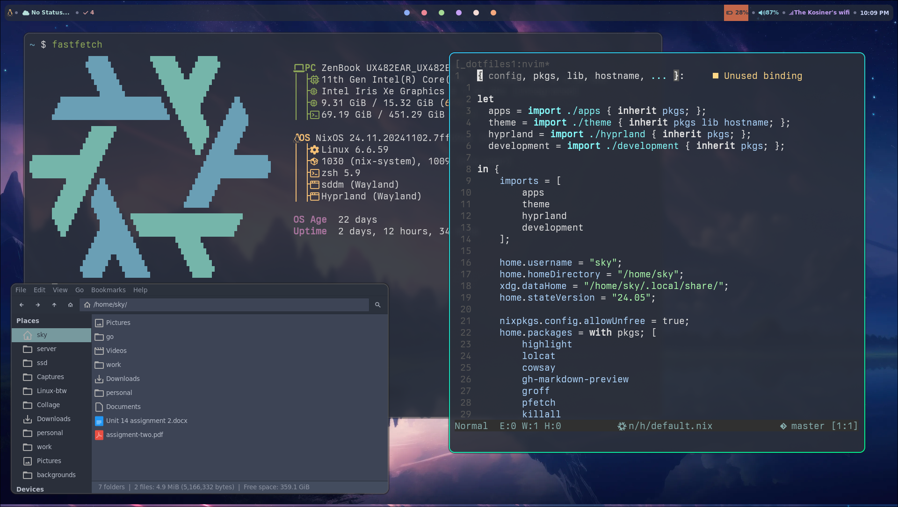

# README

## What I use
* Dvorak btw
* Hyprland
* Nix BTW
* Noevim
* Lf
* Zsh
* Alacritty
    * Berkley mono font (such a good font, would recommend to anyone)

* More info on my [website](https://skykosiner.com/tools)

## TODO
- [ ] Better way to setup secrets in nix with sops (it kind of sucks rn lol)
