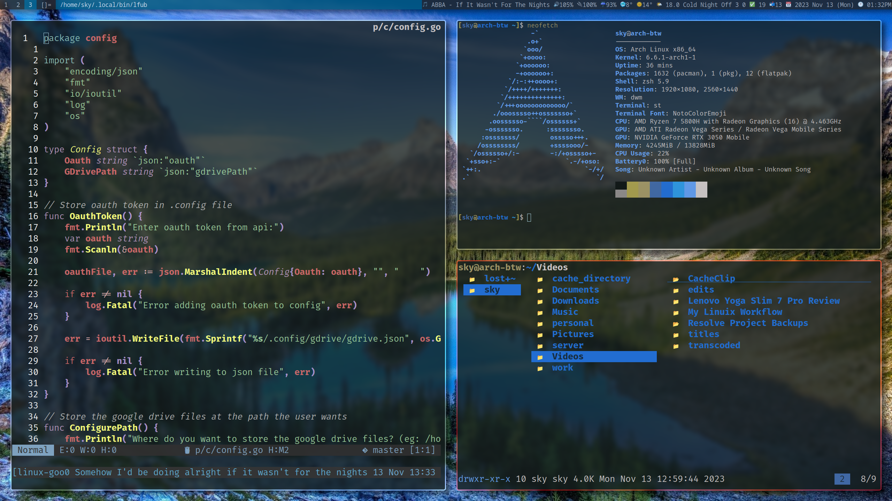

# Dotfiles

* I'm using stow to manage my dotfiles

## What I'm using
* Qtile for my window manger
* Neovim as my main text editor
* St for my terminal (https://github.com/skykosiner/st)
* Lf for my file manager
* Brave as my browser
* Zsh as my main shell
* Zauthura as my pdf viewer

## Personal note
* To update spotify albums use [this](https://developer.spotify.com/web*api/console/get*current*user*saved*albums/)
